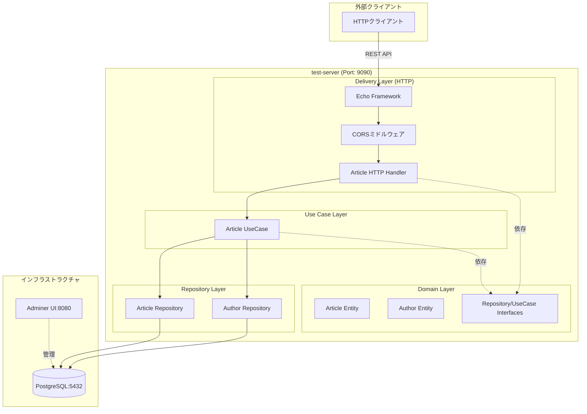
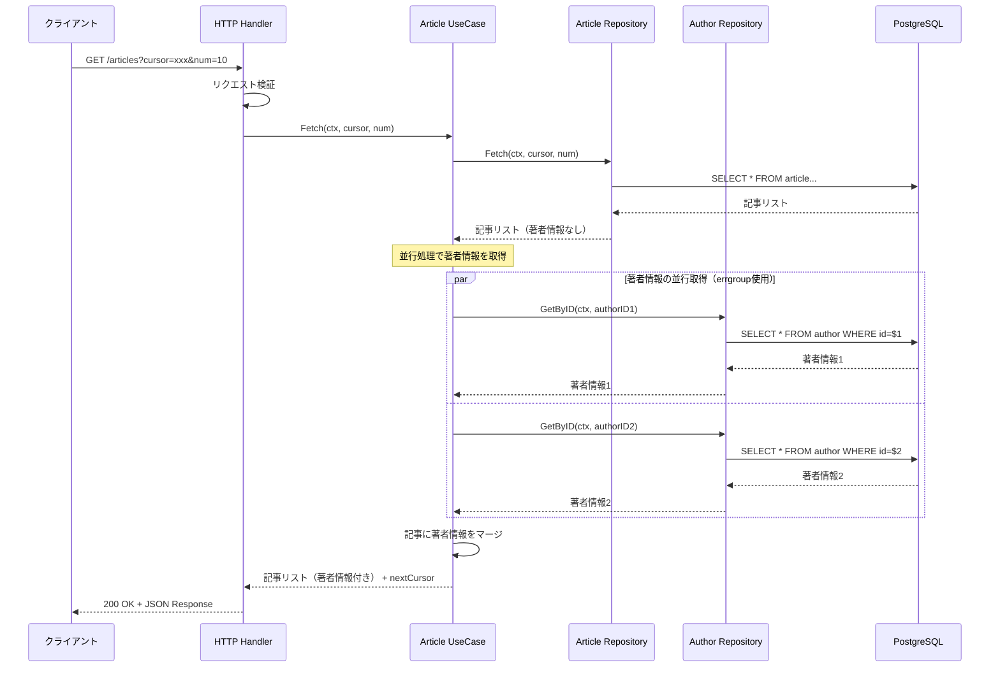
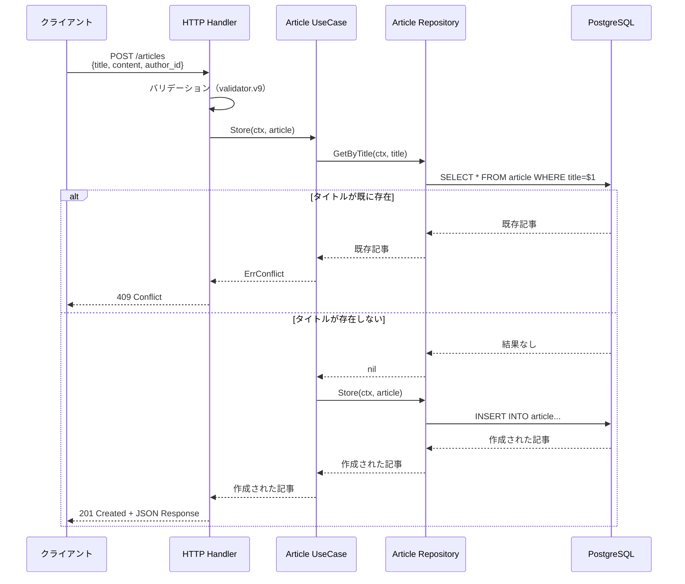

# test-server アーキテクチャドキュメント

## 概要

このプロジェクトは**Clean Architecture**に基づいたGo言語のRESTful APIサーバーで、記事管理システムを提供します。

## システム構成図



## 技術スタック

### コアフレームワーク & 言語
- **Go 1.25**: プログラミング言語
- **Echo v4**: メインWebフレームワーク（記事API）
- **Gin**: 代替Webフレームワーク（pkg/cmd/server）

### データベース
- **PostgreSQL 18**: メインデータベース
- **lib/pq**: PostgreSQLドライバ

### 主要ライブラリ
- **Viper**: 設定管理
- **Zap**: 構造化ログ
- **validator.v9**: リクエストバリデーション
- **golang.org/x/sync/errgroup**: 並行処理のゴルーチン管理
- **google.golang.org/protobuf**: Protocol Buffers サポート

### インフラストラクチャ & DevOps
- **Docker**: コンテナ化（マルチステージビルド）
- **Docker Compose**: ローカル開発環境
- **Kubernetes**: 本番環境オーケストレーション
- **k6**: 負荷テスト
- **Trivy**: セキュリティ脆弱性スキャン
- **Adminer**: データベース管理UI

### CI/CD
- **GitHub Actions**: 自動化ワークフロー
- **Renovate Bot**: 依存関係の自動更新

## プロジェクト構造

```
/home/user/test-server/
├── app/                          # メインアプリケーションエントリーポイント
├── domain/                       # ドメインモデルとインターフェース
├── article/                      # 記事機能モジュール
│   ├── delivery/http/           # HTTPハンドラとミドルウェア
│   ├── repository/postgres/     # PostgreSQLデータアクセス層
│   └── usecase/                 # ビジネスロジック層
├── author/                       # 著者機能モジュール
│   └── repository/postgres/     # PostgreSQLデータアクセス層
├── pkg/cmd/server/              # 代替サーバーパッケージ（Ginベース）
├── proto/                        # Protocol Buffer定義
├── pb/                          # 生成されたProtocol Bufferコード
├── k6/                          # 負荷テストスクリプト
├── kubernetes/raw/              # Kubernetesデプロイメントマニフェスト
├── .github/workflows/           # CI/CDパイプライン
├── config.json                  # アプリケーション設定
├── docker-compose.yaml          # Docker Compose設定
├── Dockerfile                   # コンテナビルド手順
└── Makefile                     # ビルド自動化
```

## Clean Architecture レイヤー

### Domain Layer (`/domain/`)
- **役割**: エンティティとビジネスルールの定義
- **ファイル**:
  - `article.go`: 記事エンティティとインターフェース（ArticleRepository, ArticleUsecase）
  - `author.go`: 著者エンティティとAuthorRepositoryインターフェース
  - `errors.go`: ドメインレベルのエラー定義（ErrNotFound, ErrConflict等）

### Use Case Layer (`/article/usecase/`)
- **役割**: ビジネスロジックの実装
- **主な機能**:
  - 記事操作のビジネスロジック
  - 著者詳細の並行取得（ゴルーチンによる並行処理）
  - コンテキストタイムアウト管理
  - 重複タイトルの競合検出

### Repository Layer
- **Article Repository** (`/article/repository/postgres/`):
  - PostgreSQLデータベース操作
  - CRUD操作
  - カーソルベースのページネーション

- **Author Repository** (`/author/repository/postgres/`):
  - 読み取り専用の著者データアクセス
  - GetById実装

### Delivery Layer (`/article/delivery/http/`)
- **役割**: HTTPリクエスト/レスポンスの処理
- **主な機能**:
  - RESTエンドポイントの実装
  - CORSミドルウェア
  - リクエストバリデーションとレスポンスフォーマット

## 主要なシーケンス図

### 記事一覧取得フロー（著者情報の並行取得を含む）



### 記事作成フロー



## APIエンドポイント

### 記事API (Echo Framework - Port 9090)

| メソッド | パス | 説明 | リクエスト | レスポンス |
|---------|------|------|-----------|-----------|
| GET | `/articles` | 記事一覧取得 | `?cursor=xxx&num=10` | 記事リスト + nextCursor |
| POST | `/articles` | 新規記事作成 | JSON: `{title, content, author_id}` | 作成された記事 (201) |
| GET | `/articles/:id` | 記事詳細取得 | Path: `id` | 記事詳細 |
| DELETE | `/articles/:id` | 記事削除 | Path: `id` | 204 No Content |

### ヘルスチェックAPI (Gin Framework - pkg/cmd/server)

| メソッド | パス | 説明 |
|---------|------|------|
| GET | `/healthz` | Liveness Probe（生存確認） |
| GET | `/readyz` | Readiness Probe（準備完了確認） |
| GET | `/tests` | テスト一覧取得 |
| POST | `/tests` | テスト作成 |

## アプリケーション起動フロー

**エントリーポイント**: `/app/main.go`

1. Viperを使用して`config.json`から設定を読み込み
2. PostgreSQLデータベースに接続
3. Echoウェブフレームワークを初期化
4. CORSミドルウェアをセットアップ
5. リポジトリ（Article, Author）を初期化
6. 2秒のタイムアウトでUseCaseを作成
7. HTTPハンドラを登録
8. ポート9090でサーバーを起動

## gRPC について

### 現在の状態

Protocol Buffersの定義ファイルとGoコードの生成設定は存在しますが、**gRPCサーバーの実装はまだありません**。

#### 既存のファイル

- **`proto/test.proto`**: TestServiceのgRPC定義
  - `Test` メッセージ（id, name, created_at, updated_at）
  - `TestCreateRequest` メッセージ
  - `TestCreateResponse` メッセージ
  - `TestService` サービス（Test RPC メソッド）

- **`pb/test.pb.go`**: protocで生成されたGoコード
  - メッセージ型の定義
  - シリアライズ/デシリアライズロジック

- **`Makefile`**: コード生成コマンド
  ```makefile
  gen-grpc-code:
      protoc --go_out=pb ./proto/test.proto
  ```

#### 実装状況

現在、このプロジェクトのメインAPIは**REST（HTTP/JSON）**で実装されており、gRPCはproto定義のみで実際のサーバー実装はありません。

将来的にgRPCサーバーを実装する場合は、以下が必要になります：
- gRPCサーバーの実装コード
- TestServiceインターフェースの実装
- gRPCサーバーの起動ロジック
- `protoc-gen-go-grpc`を使用したgRPCスタブの生成

## インフラストラクチャ構成

### Docker Compose（ローカル開発環境）

```yaml
サービス:
  - test-server: アプリケーション（Port 9090）
  - postgres: PostgreSQL 18（Port 5432）
  - adminer: データベース管理UI（Port 8080）
```

### Kubernetes（本番環境）

- **デプロイメント**: 2レプリカ構成
- **リソース制限**:
  - Memory: 512Mi (limit), 256Mi (request)
  - CPU: 100m (limit), 50m (request)
- **プローブ**: Liveness & Readiness Probes設定済み
- **設定管理**: ConfigMap & Secret対応
- **オートスケーリング**: HPA（Horizontal Pod Autoscaler）構成済み

### CI/CDパイプライン

#### PRワークフロー
- Goビルド検証
- Trivy IaCセキュリティスキャン
- CRITICAL/HIGH脆弱性で失敗

#### Pushワークフロー（mainブランチ）
- DockerイメージビルドとGitHub Container Registryへのプッシュ
- Trivy脆弱性スキャン
- GitHub SecurityへのSARIFアップロード

## データベーススキーマ

### 接続情報
```
DSN: host=postgres port=5432 user=user password=password dbname=article sslmode=disable
```

### テーブル
- **article**: 記事データ
- **author**: 著者データ

## アーキテクチャの特徴

1. **Clean Architecture**: ドメイン、ユースケース、インフラストラクチャレイヤーの明確な分離
2. **依存性注入**: コンストラクタを通じたリポジトリとユースケースの注入
3. **インターフェースベース設計**: ドメインインターフェースによるテスト容易性と実装の交換可能性
4. **カーソルベースページネーション**: Base64エンコードされたタイムスタンプによる効率的なページネーション
5. **コンテキスト管理**: コンテキスト伝播による適切なタイムアウト処理
6. **並行処理**: errgroupによる著者情報の並列取得
7. **本番環境対応**: ヘルスチェック、構造化ログ、セキュリティスキャン、リソース制限
8. **クラウドネイティブ**: コンテナ化、Kubernetes対応、適切な可観測性フック

## 負荷テスト

**k6**を使用した負荷テストスクリプトが`/k6`ディレクトリに用意されています。

## セキュリティ

- **Trivy**: DockerイメージとIaCの脆弱性スキャン
- **非rootユーザー**: コンテナはUID 12345で実行
- **静的バイナリ**: CGO_ENABLED=0での静的コンパイル
- **Alpine Linux**: 軽量かつセキュアなベースイメージ（Alpine 3.22）

---

最終更新日: 2025-11-08
