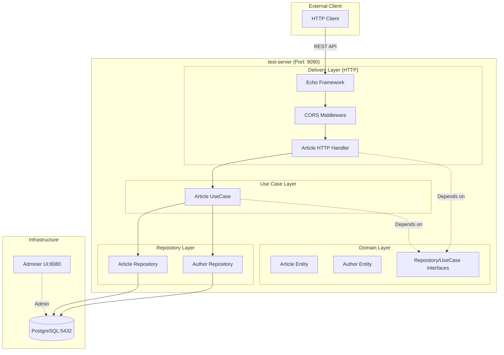
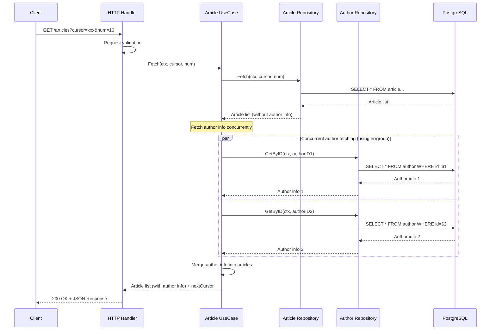
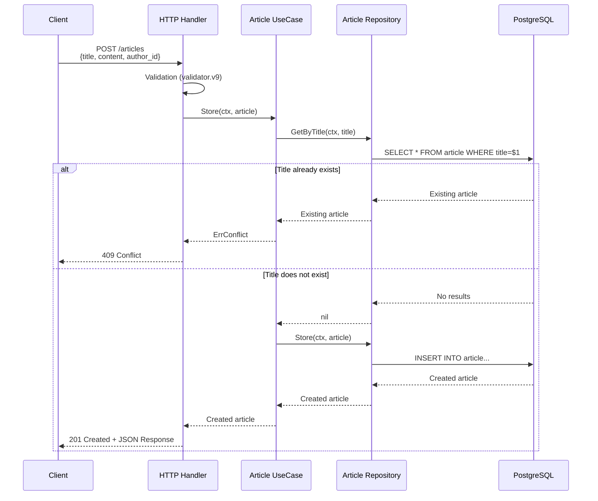

# test-server Architecture Document

## Overview

This project is a Go RESTful API server based on **Clean Architecture**, providing an article management system.

## System Architecture Diagram



## Technology Stack

### Core Framework & Language
- **Go 1.25**: Programming language
- **Echo v4**: Main web framework (Article API)
- **Gin**: Alternative web framework (pkg/cmd/server)

### Database
- **PostgreSQL 18**: Main database
- **lib/pq**: PostgreSQL driver

### Key Libraries
- **Viper**: Configuration management
- **Zap**: Structured logging
- **validator.v9**: Request validation
- **golang.org/x/sync/errgroup**: Goroutine management for concurrent processing
- **google.golang.org/protobuf**: Protocol Buffers support

### Infrastructure & DevOps
- **Docker**: Containerization (multi-stage build)
- **Docker Compose**: Local development environment
- **Kubernetes**: Production orchestration
- **k6**: Load testing
- **Trivy**: Security vulnerability scanning
- **Adminer**: Database management UI

### CI/CD
- **GitHub Actions**: Automation workflows
- **Renovate Bot**: Automatic dependency updates

## Project Structure

```
/home/user/test-server/
├── app/                          # Main application entry point
├── domain/                       # Domain models and interfaces
├── article/                      # Article feature module
│   ├── delivery/http/           # HTTP handlers and middleware
│   ├── repository/postgres/     # PostgreSQL data access layer
│   └── usecase/                 # Business logic layer
├── author/                       # Author feature module
│   └── repository/postgres/     # PostgreSQL data access layer
├── pkg/cmd/server/              # Alternative server package (Gin-based)
├── proto/                        # Protocol Buffer definitions
├── pb/                          # Generated Protocol Buffer code
├── k6/                          # Load test scripts
├── kubernetes/raw/              # Kubernetes deployment manifests
├── .github/workflows/           # CI/CD pipelines
├── config.json                  # Application configuration
├── docker-compose.yaml          # Docker Compose configuration
├── Dockerfile                   # Container build instructions
└── Makefile                     # Build automation
```

## Clean Architecture Layers

### Domain Layer (`/domain/`)
- **Role**: Define entities and business rules
- **Files**:
  - `article.go`: Article entity and interfaces (ArticleRepository, ArticleUsecase)
  - `author.go`: Author entity and AuthorRepository interface
  - `errors.go`: Domain-level error definitions (ErrNotFound, ErrConflict, etc.)

### Use Case Layer (`/article/usecase/`)
- **Role**: Implement business logic
- **Key Features**:
  - Business logic for article operations
  - Concurrent author detail fetching (using goroutines)
  - Context timeout management
  - Duplicate title conflict detection

### Repository Layer
- **Article Repository** (`/article/repository/postgres/`):
  - PostgreSQL database operations
  - CRUD operations
  - Cursor-based pagination

- **Author Repository** (`/author/repository/postgres/`):
  - Read-only author data access
  - GetById implementation

### Delivery Layer (`/article/delivery/http/`)
- **Role**: Handle HTTP request/response
- **Key Features**:
  - REST endpoint implementation
  - CORS middleware
  - Request validation and response formatting

## Key Sequence Diagrams

### Article List Fetch Flow (including concurrent author fetching)



### Article Creation Flow



## API Endpoints

### Article API (Echo Framework - Port 9090)

| Method | Path | Description | Request | Response |
|--------|------|-------------|---------|----------|
| GET | `/articles` | Get article list | `?cursor=xxx&num=10` | Article list + nextCursor |
| POST | `/articles` | Create new article | JSON: `{title, content, author_id}` | Created article (201) |
| GET | `/articles/:id` | Get article details | Path: `id` | Article details |
| DELETE | `/articles/:id` | Delete article | Path: `id` | 204 No Content |

### Health Check API (Gin Framework - pkg/cmd/server)

| Method | Path | Description |
|--------|------|-------------|
| GET | `/healthz` | Liveness Probe |
| GET | `/readyz` | Readiness Probe |
| GET | `/tests` | Get test list |
| POST | `/tests` | Create test |

## Application Startup Flow

**Entry Point**: `/app/main.go`

1. Load configuration from `config.json` using Viper
2. Connect to PostgreSQL database
3. Initialize Echo web framework
4. Set up CORS middleware
5. Initialize repositories (Article, Author)
6. Create UseCase with 2-second timeout
7. Register HTTP handlers
8. Start server on port 9090

## About gRPC

### Current State

Protocol Buffers definition files and Go code generation settings exist, but **gRPC server implementation is not yet available**.

#### Existing Files

- **`proto/test.proto`**: gRPC definition for TestService
  - `Test` message (id, name, created_at, updated_at)
  - `TestCreateRequest` message
  - `TestCreateResponse` message
  - `TestService` service (Test RPC method)

- **`pb/test.pb.go`**: Generated Go code by protoc
  - Message type definitions
  - Serialization/deserialization logic

- **`Makefile`**: Code generation command
  ```makefile
  gen-grpc-code:
      protoc --go_out=pb ./proto/test.proto
  ```

#### Implementation Status

Currently, the main API of this project is implemented with **REST (HTTP/JSON)**, and gRPC only has proto definitions without actual server implementation.

To implement a gRPC server in the future, the following will be required:
- gRPC server implementation code
- TestService interface implementation
- gRPC server startup logic
- gRPC stub generation using `protoc-gen-go-grpc`

## Infrastructure Configuration

### Docker Compose (Local Development Environment)

```yaml
Services:
  - test-server: Application (Port 9090)
  - postgres: PostgreSQL 18 (Port 5432)
  - adminer: Database management UI (Port 8080)
```

### Kubernetes (Production Environment)

- **Deployment**: 2 replica configuration
- **Resource Limits**:
  - Memory: 512Mi (limit), 256Mi (request)
  - CPU: 100m (limit), 50m (request)
- **Probes**: Liveness & Readiness Probes configured
- **Configuration Management**: ConfigMap & Secret support
- **Auto-scaling**: HPA (Horizontal Pod Autoscaler) configured

### CI/CD Pipeline

#### PR Workflow
- Go build verification
- Trivy IaC security scan
- Fails on CRITICAL/HIGH vulnerabilities

#### Push Workflow (main branch)
- Docker image build and push to GitHub Container Registry
- Trivy vulnerability scan
- SARIF upload to GitHub Security

## Database Schema

### Connection Information
```
DSN: host=postgres port=5432 user=user password=password dbname=article sslmode=disable
```

### Tables
- **article**: Article data
- **author**: Author data

## Architecture Characteristics

1. **Clean Architecture**: Clear separation of domain, use case, and infrastructure layers
2. **Dependency Injection**: Repository and use case injection through constructors
3. **Interface-based Design**: Domain interfaces for testability and implementation swappability
4. **Cursor-based Pagination**: Efficient pagination using Base64-encoded timestamps
5. **Context Management**: Proper timeout handling through context propagation
6. **Concurrent Processing**: Parallel author info fetching using errgroup
7. **Production Ready**: Health checks, structured logging, security scanning, resource limits
8. **Cloud Native**: Containerized, Kubernetes-ready, proper observability hooks

## Load Testing

Load test scripts using **k6** are available in the `/k6` directory.

## Security

- **Trivy**: Vulnerability scanning for Docker images and IaC
- **Non-root User**: Container runs with UID 12345
- **Static Binary**: Static compilation with CGO_ENABLED=0
- **Alpine Linux**: Lightweight and secure base image (Alpine 3.22)

---

Last Updated: 2025-11-08
